# Tarea Introduccion a HTTP y URI :
## Grupo :
    | Participantes  |
    |-----------------------|
    | Jaime Gonzalo Acuña Napan |
    | Alejandra Aztirma Zuñiga Chicaña |
    | Edward Alexander Canales Yarin |
* Pregunta:¿Cuáles son las dos diferencias principales que has visto anteriormente y lo que ves en un navegador web 'normal'? ¿Qué explica estas diferencias?

 Respuesta: En este problema nos muestran una pagina donde hay palabras aleatorias ,cada vez que entramos en esta pagina se genera una palabra nueva :
 
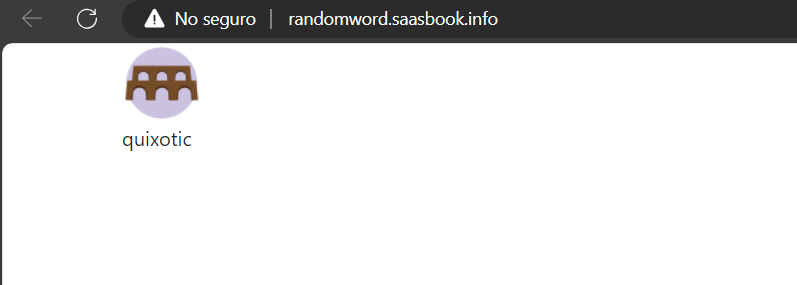

y si cargamos otra vez la pagina aparecera una nueva

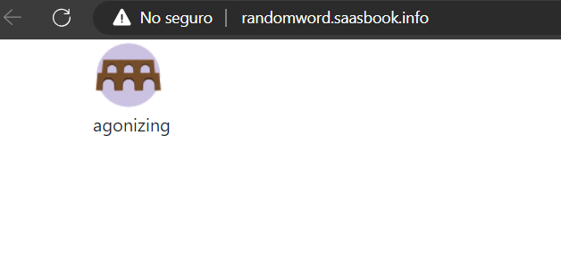

Ahora entrando desde la terminal , accedemos a la pagina y nos devuelve en texto el html 

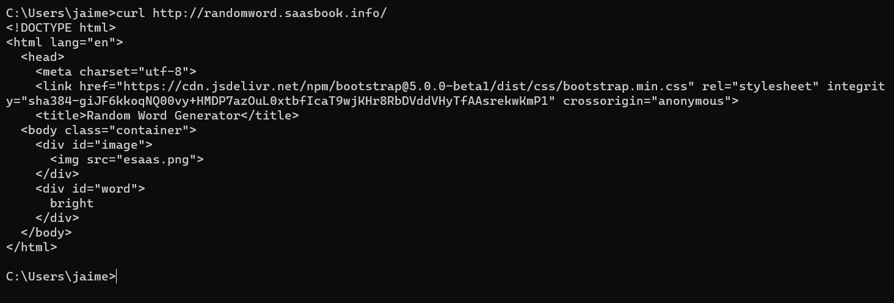

ahora si copiamos esto en un archivo html y lo vemos en un navegador 

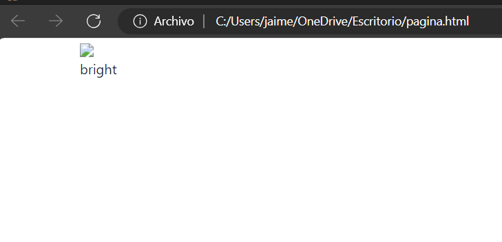

vemos que nos devuelve una palabra aleatoria , pero si cargamos la pagina otra vez , esta no dara palabras aleatorias , porque pasa esto ?
porque solo hemos copiado una respuesta del servidor y si recargamos cargamos esta unica respuesta una y otra vez , para obtener otra palabra aleatoria tendriamos que usar nuevamente el comando curl 

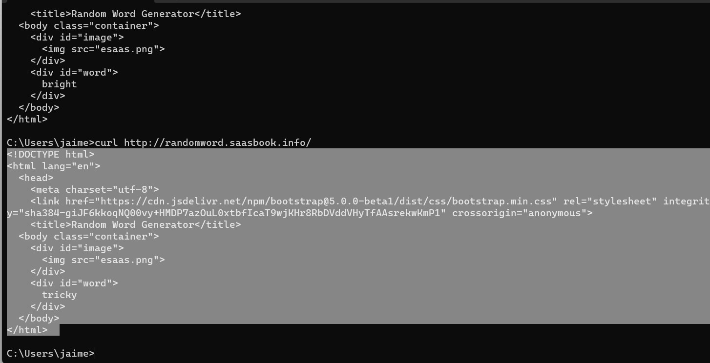

si copiamos esto nuevamente en el html y cargamos la pagina ,veremos que nnos da una nueva palabra aleatorio

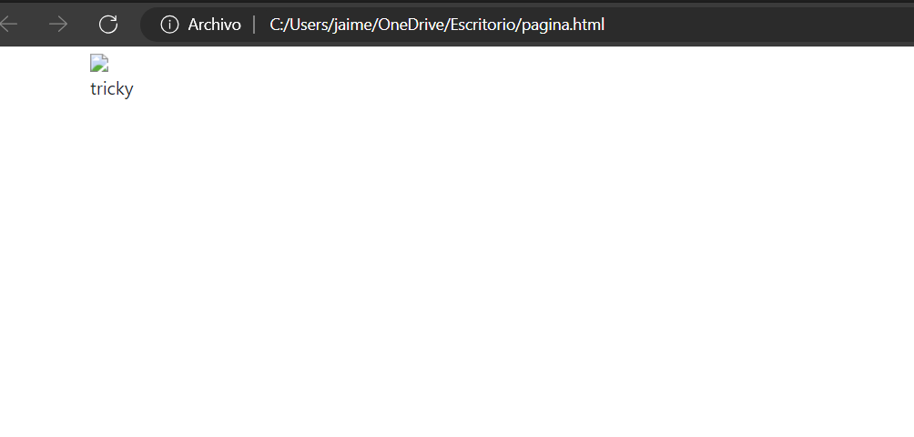

* Pregunta: Suponiendo que estás ejecutando curl desde otro shell ¿qué URL tendrás que pasarle a curl para intentar acceder a tu servidor falso y por qué?

Respuesta: Primero crearemos el servidor web en el puerto 8081 :

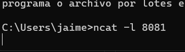

En ese momento se ejecuta el servidor en el puerto 8081 , ahora para acceder a este , pondremos ele comando curl http://localhost:8081

ejecutando este comando , veremos que en el primer shell que lanza un GET en el servidor 

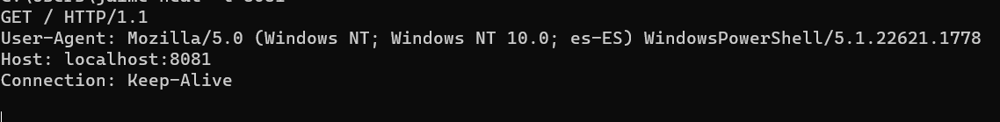

* Pregunta: La primera línea de la solicitud identifica qué URL desea recuperar el cliente. ¿Por qué no ves http://localhost:8081 en ninguna parte de esa línea?

Porque esta no vendria siendo la solicitud , si no el lugar a donde se hace la solicitud ,tambien es redundante ya que este servidor es local 

* Pregunta: Según los encabezados del servidor, ¿cuál es el código de respuesta HTTP del servidor que indica el estado de la solicitud del cliente y qué versión del protocolo HTTP utilizó el servidor para responder al cliente?

Ejecutando el comando curl -i 'http://randomword.saasbook.info'

esto nos dara los encabezados del servidor y tambien el html 

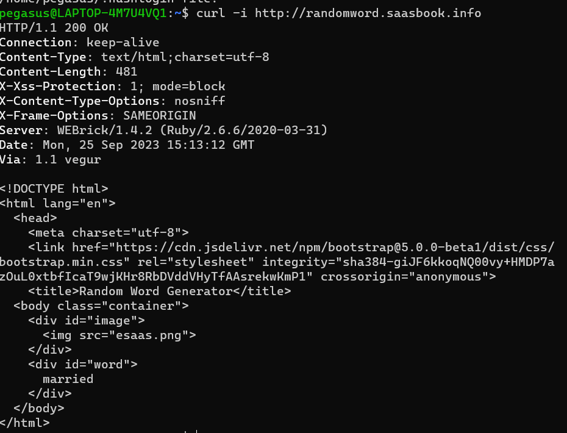

Si vemos la linea numero 1 vemos que nos pone :

HTTP/1.1 200 OK 

esto significa que la version del http es la 1.1 , el numero 200 es que la solictud es exitosa y la expresion 'ok' es para una descripcion legible de que la conexion a sido correcta 

* Pregunta: Cualquier solicitud web determinada puede devolver una página HTML, una imagen u otros tipos de entidades. ¿Hay algo en los encabezados que crea que le dice al cliente cómo interpretar el resultado?.

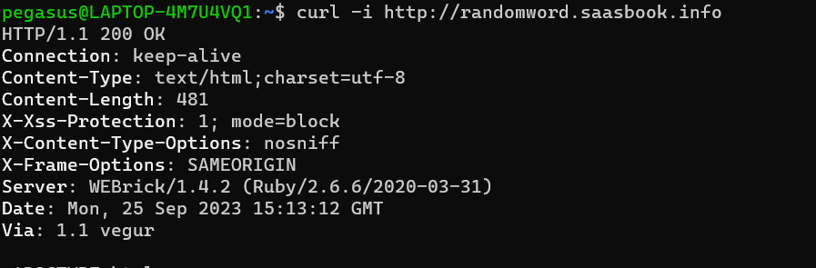

Podemos observar que hay muchos encabezados , esta es toda la informacion de la solicitud del servidor , primero nos da la version del protocolo http 
y si la solicitud a sido exitosa 
tambien nos muestra el tipo de contenido , la longitud del contenido y muchas mas informacion .

* Pregunta: ¿Cuál sería el código de respuesta del servidor si intentaras buscar una URL inexistente en el sitio generador de palabras aleatorias? Pruéba esto utilizando el procedimiento anterior.

Ahora si usamos el comando curl -i http://randomword.saasbook.info/a vemos que no encuentra la pagina , ya que esta pagina no cuenta con el directorio por lo que en la informacion nos devuelve un error 

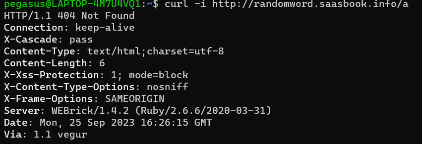

especificamente el error 404 significa que no encuentra la pagina 

¿Qué otros códigos de error HTTP existen? Utiliza Wikipedia u otro recurso para conocer los significados de algunos de los más comunes: 200, 301, 302, 400, 404, 500. Ten en cuenta que estas son familias de estados: todos los estados 2xx significan funcionó, todos los 3xx son redireccionar etc.
Tanto el encabezado 4xx como el 5xx indican condiciones de error. ¿Cuál es la principal diferencia entre 4xx y 5xx?.

 2xx:   
 Estos códigos indican que la solicitud del cliente se recibió, se comprendió y se procesó correctamente en el servidor.    
 3xx:   
 Estos códigos se utilizan para indicar redireccionamientos de URL. Indican que el cliente debe tomar alguna acción adicional para completar la solicitud   
 4xx:   
 Estos errores se generan cuando el servidor recibe una solicitud que no puede procesar debido a problemas en el lado del cliente   
 5xx:   
 Estos errores son generados por el servidor web y generalmente indican problemas en el lado del servidor

## ¿Que es un cuerpo de Request ?
 * Pregunta: Cuando se envía un formulario HTML, se genera una solicitud HTTP POST desde el navegador. Para llegar a tu servidor falso, ¿con qué URL deberías reemplazar Url-servidor-falso en el archivo anterior?

 Para que esto se ejecute en el servidor local del puerto 8081 pondremos el link del host osea : http://localhost:8081 

 Abriendo el archivo html ,nos mostraria : 

  
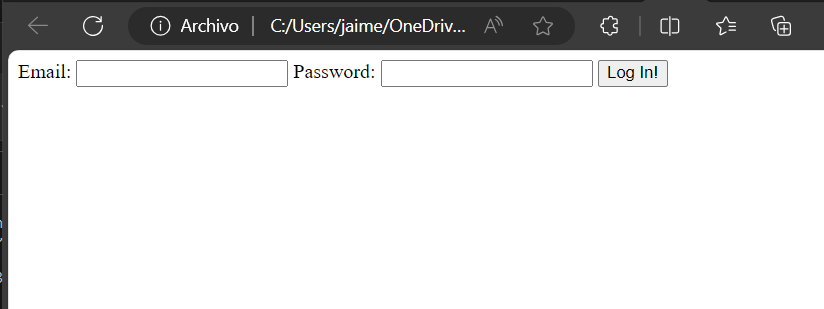

ahora cambiando el servidor , si ingresamos algun correo y contraseña y vemos el estado del servidor veremos que se ha generado un post 

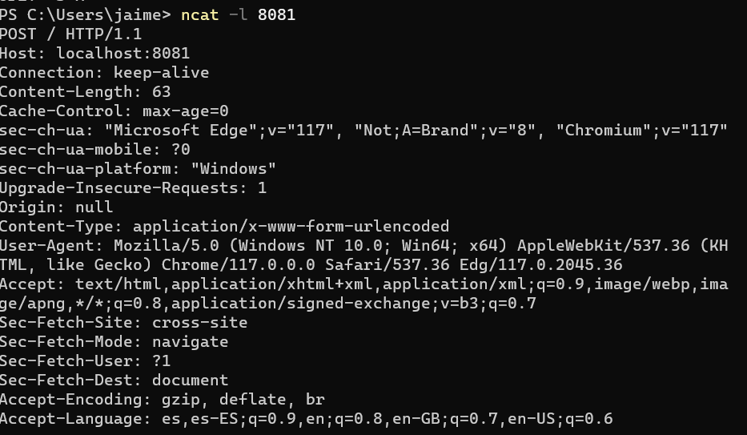

esto quiere decir que la informacion ingresada a sido recibida por el servidor 

* Pregunta:¿Cómo se presenta al servidor la información que ingresó en el formulario? ¿Qué tareas necesitaría realizar un framework SaaS como Sinatra o Rails para presentar esta información en un formato conveniente a una aplicación SaaS escrita, por ejemplo, en Ruby?

