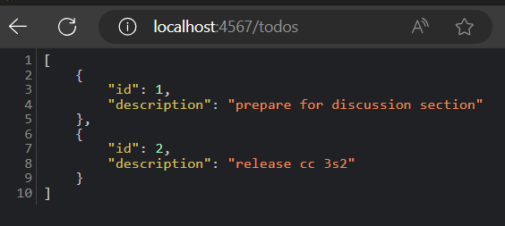

## Demostración de MVC, rutas RESTful y CRUD con Sinatra 


### Instrucciones

En esta sección veremos cómo aplicar ideas de MVC, RESTful Routes y CRUD en el contexto de Sinatra para crear una aplicación de lista de tareas pendientes. 
Cuando hayas terminado, los usuarios deberían poder ir a tu sitio web, ver su lista de tareas pendientes, crear nuevos elementos de la lista, editar elementos de la lista y eliminar elementos de la lista.

Construiremos el código base, con el código de inicio ubicado dado en el repositorio de la actividad. Aquí está la referencia a [Sinatra](https://sinatrarb.com/intro.html) ¡que será útil!.

Presenta esta tarea individual en un repositorio llamado MVC-Restful, CRUD con evidencia del proceso dado. Puedes trabajar en equipo para resolver los ejercicios.

### Configuración

```
  cd sinatra-intro/
  bundle install
  ruby template.rb # O: bundle exec ruby template.rb
```
<details>
    <summary>Resultado</summary>
    <p><blockquote> Configurando y ejecutando el codigo template.rb 


ejecutando template.rb


</blockquote></p>
</details>


Luego, ingresa el siguiente enlace en un navegador para ver la página web y verificar si está funcionando.

```
  http://localhost:4567/todos
```
<details>
<summary>Resultado</summary><p><blockquote>Cuando ingresamos a la ruta http://localhost:4567/todos, nos muestra la siguiente pagina:



mientras que en el lado del servidor nos muestra lo siguiente:


</blockquote></p></details>

Además, prueba el siguiente comando usando 'curl' para verificar que la aplicación se esté ejecutando localmente y responda. El comando activa una solicitud `GET` para recuperar la lista de "cosas por hacer" y debería recibir una respuesta que se muestra en la salida estándar de la línea de comando.

```
  curl http://localhost:4567/todos
```

<details>
<summary>Resultado</summary><p><blockquote> Cuando ejecutamos el comando curl http://localhost:4567/todos, nos muestra lo siguiente:


mientras que en el lado del servidor nos muestra lo siguiente:


</p></blockquote></details>


En los siguientes ejercicios, agregaremos más rutas y podrás continuar usando comandos curl con diferentes argumentos para verificar la corrección de sus comportamientos.

Objetivo: Tu tarea es implementar las partes del archivo denominado `TU CODIGO AQUI`. La referencia que contiene las soluciones se encuentra en el archivo `final.rb`.

### Parte 1

Lo primero que vamos a hacer es crear un modelo. A diferencia de Rails, Sinatra no tiene MVC integrado, así que vamos a piratear el nuestro. Usaremos `ActiveRecord` sobre una base de datos SQLite. En esta aplicación, ¿cuál será nuestro modelo y qué operaciones CRUD le aplicaremos?

<details>
<summary>Respuesta</summary><p><blockquote>

Imaginemos que desarrollamos un modelo para tareas , las operaciones CRUD que le aplicaremos son:

- index:  Mostrar una lista de todas las tareas en la base de datos
- create:   Agregar una nueva tarea a la base de datos
- read: Ver los detalles de una tarea específica
- update:Editar los detalles de una tarea existente
- destroy: Eliminar una tarea de la base de datos
</p></blockquote>
</details>

### Parte 2

A continuación, creemos algunas rutas para que los usuarios puedan interactuar con la aplicación. Aquí hay una URL de ejemplo:

```
  https://www.etsy.com/search?q=test#copy
```
Primero, especifica qué partes de la URL son  componentes según la discusión sobre la forma de una URL. Consulta esta publicación de [IBM](https://www.ibm.com/docs/en/cics-ts/5.1?topic=concepts-components-url) que detalla los componentes de una URL.
<details>
<summary>Respuesta</summary><p><blockquote>


- https:// : Este vendria siendo el protocolo con el se accede al recurso
- etsy :Este es el dominio ,la cual es el nombre de host (tambien puede ser un IP) que identifica el servidor en el que se encuentra el recurso
- 443 : Este numero es el puerto , que indica el puerto de red en el que el servidor está escuchando
- /search : La ruta ,la parte de la URL que identifica la ubicación del recurso en el servidor
- q=test :Esta es la consulta , la cual es una cadena de parámetros que se utiliza para enviar datos al servidor
- copy :es un fracmento , este se utiliza para identificar una sección específica dentro del recurso
</p></blockquote>
</details>

En Sinatra, el enrutamiento y el controlador están acoplados, lo que facilita la declaración de rutas. Declaramos algunas rutas RESTful para que podamos ver una lista de tareas pendientes, crear una tarea pendiente, editar una tarea pendiente y eliminar una tarea pendiente. ¿Qué acciones RESTful deberíamos utilizar para estos?

### Parte 3

Dado que HTTP es un protocolo RESTful, cada solicitud debe ir seguida de una respuesta, por lo que debemos devolver una vista o redirigir a cada solicitud. Usaremos JSON para las respuestas, que es similar a lo que hacen muchas API. ¿Hacia dónde debería ir la respuesta?.
<details>
<summary>Respuesta</summary><p><blockquote>
La respuesta a una solicitud HTTP en una API RESTful generalmente va al cliente que hizo la solicitud y su contenido depende del propósito de la solicitud ,por ejemplo : si se utilizo un metodo GET ,si un cliente solicita detalles sobre un producto específico, la API debería devolver un objeto JSON con esos detalles.
En cambio si se utilizo un metodo POST ,si un cliente envía una solicitud para crear un nuevo producto, la API debería devolver un objeto JSON con los detalles del producto recién creado.
Como se menciono anteriormente , la respuesta generalmente va hacia al cliente pero el contenido de esta respuesta depende del proposito de la solicitud.
</p></blockquote>
</details>
