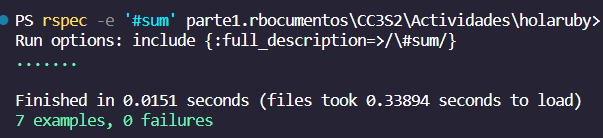
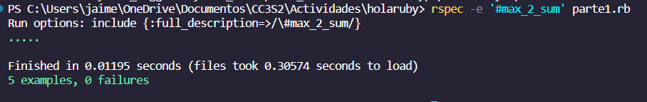
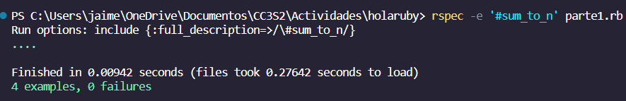
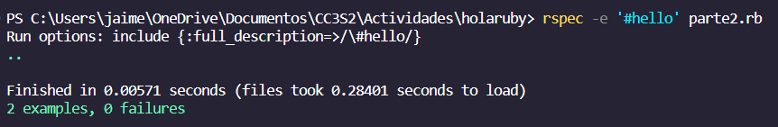
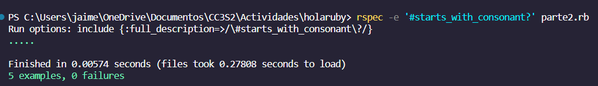
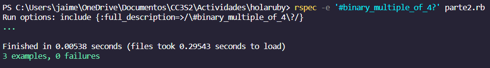
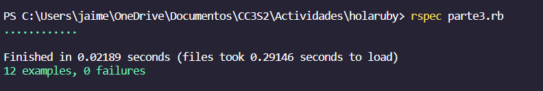

## Parte 1: Arreglos, hashes y enumerables
Consulta la documentación de Ruby 3.x + sobre Array, Hash y Enumerable, ya que podrían ser de gran ayuda con estos ejercicios. Aunque Ruby admite for y while, considera usar la sintaxis de bloque con cada una para un uso más idiomático de Ruby.

1.Define un método sum(array) que tome un   arreglo de números enteros como argumento y devuelva la suma de sus elementos. Para una matriz vacía, debería devolver cero. Ejecuta las pruebas asociadas a través de:

Resultado

<blockquote>
 Definimos un metodo que sume los elementos de un arreglo, para ello utilizamos el metodo inject, el cual nos permite sumar los elementos de un arreglo, en este caso, el metodo inject recibe como parametro un valor inicial 0, y luego recorre el arreglo sumando los elementos del arreglo con el valor inicial finalmente retorna el resultado de la suma.
 el codigo nos quedaria de la siguiente manera:

<pre><code class="ruby">def sum(array)
    array.inject(0,:+)
    end
</code></pre>

Ejecutaremos las puebas asociadas con el comando :

     rspec -e '#sum' part1.rb

ejecutando el comando vemos que pasa todas las pruebas :
    

</blockquote>

2.Define un método max_2_sum(array) que tome un arreglo de números enteros como argumento y devuelva la suma de sus dos elementos más grandes. Para un arreglo vacío, debería devolver cero. Para un arreglo con solo un elemento, debería devolver ese elemento (considera si los dos elementos más grandes también tienen el mismo valor). Ejecuta las pruebas asociadas a través de: 
 

Resultado

<blockquote> 
Definimos un metodo que sume los 2 numeros maximos en el arreglo, para ello utilizamos el metodo sort, el cual nos permite ordenar los elementos de un arreglo, en este caso, el metodo sort recibe como parametro un valor inicial 0, y luego recorre el arreglo ordenando los elementos del arreglo con el valor inicial para luego retorna el resultado de la suma de los 2 elementos mas grandes.
 el codigo nos quedaria de la siguiente manera:

<pre><code class="ruby">  def max_2_sum arr
    sorted_arr = arr.sort
    if sorted_arr.length >= 2
      sorted_arr[-1] + sorted_arr[-2]
    elsif sorted_arr.length == 1
      sorted_arr[0]
    else
      0
    end
  end
</code></pre>

Ejecutaremos las puebas asociadas con el comando :

     rspec -e '#max_2_sum' parte1.rb

Ejecutando el comando vemos que pasa todas las pruebas :
    

</blockquote>

3.Define un método sum_to_n?(array, n) que toma un arreglo de números enteros y un número entero adicional n, como argumentos y devuelva verdadero si dos elementos cualesquiera en el arreglo de enteros suman n. sum_to_n?([], n) debería devolver false para cualquier valor de n, por definición. Ejecuta las pruebas asociadas a través de:

Resultado

<blockquote>
Definimos una funcion que vera las posibles convinaciones del arreglo viendo si alguna de estas suma el valor dado, para ello utilizamos el metodo combination, el cual nos permite ver las posibles convinaciones de 'a' numeros , en este caso a = 2 ,para que coja numeros de 2 en 2 , asi sumara todos los posibles casos en pares para encontrar si alguna de estas en el valor ingresado n.
 el codigo nos quedaria de la siguiente manera:

<pre><code class="ruby">  def sum_to_n? arr, n
    if arr.length < 2
        false
      else
        arr.combination(2).any? { |a, b| a + b == n }
      end
  end
</code></pre>

Ejecutaremos las puebas asociadas con el comando :

     rspec -e '#sum_to_n' parte1.rb

Ejecutando el comando vemos que pasa todas las pruebas :

</blockquote>

# Parte 2: Cadenas y expresiones regulares
Consulta la documentación sobre String y Regexp, ya que podrían ser de gran ayuda con estos ejercicios.

Para referencias futuras también, consulta https://rubular.com/ para consultas relacionadas con expresiones regulares.

1.Define un método hello(name) que tome una cadena que represente un nombre y devuelva la cadena "Hello", concatenada con el nombre. Ejecuta las pruebas asociadas a través de:

Resultado

<blockquote>
Definimos un metodo que reciba un nombre y nos devuelva un saludo, para ello utilizamos solo la impresion ,en este caso, el metodo solo recibe como parametro un nombre y luego imprime el mensaje de saludo con el nombre, al final retornara el mensaje con el nombre.
 el codigo nos quedaria de la siguiente manera:
<pre><code class="ruby">  def hello(name)
    "Hello, #{name}"
  end
  </pre></code>
    Ejecutaremos las pruebas con el comando :
        
        rspec -e '#hello' parte2.rb

Ejecutando el comando vemos que pasa todas las pruebas :

</blockquote>

2.Define un método start_with_consonant?(s) que tome una cadena y devuelva verdadero si comienza con una consonante y falso en caso contrario. Asegúrate de que funcione tanto para mayúsculas como para minúsculas y para otras letras. Ejecuta las pruebas asociadas a través de:

Resultado

<blockquote>
Definimos un metodo que reciba una cadena y nos devuelva true si comienza con una consonante y false en caso contrario, para ello utilizamos expresiones regulares para ver si comienza con alguna de las consonantes ,
    el codigo nos quedaria de la siguiente manera:

<pre><code class="ruby">  
  def starts_with_consonant?(s)
    !!(s =~ /^[b-df-hj-np-tv-z]/i)
  end

</code></pre>

Ejecutaremos las pruebas con el comando :
        
        rspec -e '#starts_with_consonant?' parte2.rb

Ejecutando el comando vemos que pasa todas las pruebas :

</blockquote>

3.Define un método binary_multiple_de_4?(s) que tome una cadena y devuelva verdadero si la cadena representa un número binario que es múltiplo de 4, como '1000'. Asegúrate de que devuelva falso si la cadena no es un número binario válido. Ejecuta las pruebas asociadas a través de:

Resultado

<blockquote>
Definimos un metodo que reciba una cadena y nos devuelva true si es un numero binario multiplo de 4 y false en caso contrario, para ello utilizamos expresiones regulares para ver si es un numero binario y luego ver si es multiplo de 4,
    el codigo nos quedaria de la siguiente manera:
<pre><code class="ruby">
      def binary_multiple_of_4?(s)
        return false unless s.match?(/^[01]+$/)
  
          decimal_value = s.to_i(2)
          decimal_value % 4 == 0
        end
</code></pre>

Ejecutaremos las pruebas con el comando :
        
        rspec -e '#binary_multiple_of_4?' parte2.rb

Ejecutando el comando vemos que pasa todas las pruebas :

</blockquote>

# Parte 3: Conceptos básicos de orientación a objetos
1.Define una clase BookInStock que representa un libro con un número ISBN, isbn y el precio del libro como número de punto flotante, precio, como atributos.

Resultado

<blockquote>
Definimos una clase BookInStock que representa un libro con un número ISBN, isbn y el precio del libro como número de punto flotante, precio, como atributos.
    el codigo nos quedaria de la siguiente manera:
<pre><code class ="ruby">
  class BookInStock
    attr_accessor :isbn, :price
    
        def initialize(isbn, price)
        raise ArgumentError, "ISBN cannot be empty" if isbn.empty?
        raise ArgumentError, "Price must be greater than zero" if price <= 0
    
        @isbn = isbn
        @price = price
        end
    
        def price_as_string
        format("$%.2f", @price)
        end
    end

</code></pre>

Definimos los atributos con attr_accessor para que se pueda acceder a estas variables facilmente , luego definimos el metodo initialize (constructor) que recibe como parametros isbn y price , en donde tambien vemos los casos en los que se ingrese mal los datos, luego definimos el metodo price_as_string que nos devuelve el precio en formato de string.

entonces veamos las pruebas con el comando :
        
        rspec  parte3.rb

vemos que el codigo pasa todas las pruebas :

</blockquote>

